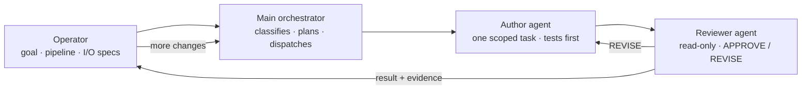

# simpleharness

An operating harness for AI coding agents, shipped as a [Claude Code](https://claude.com/claude-code) plugin.

simpleharness runs a Claude Code session as an orchestrator. An **author** agent implements, an independent **reviewer** agent checks the work, and no task counts as done without fresh test evidence. I built it to keep long, high-stakes agent sessions reliable, and used it across the build of an in-house billing application, including a database redesign with zero change in billed totals.

**Version 1.0.3** · Windows-first (PowerShell 7) · installs as a Claude Code plugin

---

## How a task flows



1. The operator sets the goal, the pipeline, and the input/output specification.
2. The main session classifies the request and plans it. It does not write production code itself.
3. Each task goes to a fresh author agent under a six-section contract: `TASK / EXPECTED OUTCOME / REQUIRED TOOLS / MUST DO / MUST NOT DO / CONTEXT`.
4. A reviewer agent that cannot edit files returns `APPROVE`, `APPROVE-WITH-MINOR-FIXES`, or `REVISE`.
5. The result and its evidence go back to the operator, who approves it or asks for more changes.

## Quality gates

- **Evidence before "done."** Run the command that proves the result, read its output, then report. The orchestrator checks the actual diff, not the agent's summary.
- **Behavior preservation.** Before a refactor, save a baseline of the outputs. Afterward, compare and classify every difference; an unexplained difference blocks the change.
- **Circuit breaker.** After three failed fixes, stop and rethink the approach instead of trying a fourth.
- **Grant ledger.** Commits, pushes, installs, and deploys wait for an explicit, recorded approval from the operator.
- **Lessons on file.** Each correction becomes an entry in [`docs/PROJECT-KNOWLEDGE.md`](docs/PROJECT-KNOWLEDGE.md) (context → pitfall → rule).

The harness is tested too:

- [`tests/harness-lint.ps1`](tests/harness-lint.ps1) runs 10 drift checks: manifests, hook paths, version pairing, the skill list, frontmatter, agent routing, vendored licenses, ASCII-only scripts, and more. Run it before every commit.
- Hook tests cover the stop gate, the prompt router, and scratch cleanup.
- [`docs/eval/skill-coverage-cases.md`](docs/eval/skill-coverage-cases.md) has 46 behavioral cases that exercise every skill, agent, and hook.

## What is inside

| Part | What it does |
|---|---|
| Operating protocol ([`CLAUDE.md`](CLAUDE.md)) | Always-on rules: delegate production code, verify before claiming done, record approvals. Injected at session start, because plugins cannot ship a `CLAUDE.md`. |
| 4 agents ([`agents/`](agents)) | `author` implements one scoped change · `reviewer` gives an independent, read-only verdict · `explorer` maps a codebase without editing · `researcher` gathers external evidence pinned to specific commits |
| 12 skills ([`skills/`](skills)) | `brainstorming` · `blueprint` · `execute-plan` · `crosscheck` · `systematic-debugging` · `handoff` · `fan-out` · `tdd` · `ast-grep` · `insane-search` · `longrun` · `onboard` |
| 3 hooks ([`hooks/hooks.json`](hooks/hooks.json)) | `SessionStart` injects the protocol · `UserPromptSubmit` adds a short reminder and points to the right skill (English and Korean keywords) · `Stop` blocks once when a written plan has stalled. All fail open. |
| MCP servers ([`.mcp.json`](.mcp.json)) | `playwright` (real-browser checks), `lsp` (code intelligence for Python and TS/JS), `context7` (library docs), `grep_app` (public code search) |

Design source of truth: [`docs/SPEC.md`](docs/SPEC.md). Component map: [`docs/ARCHITECTURE.md`](docs/ARCHITECTURE.md).

## Install

Prerequisites: Claude Code and an authenticated `git` (for example, `gh auth login`). Then, inside Claude Code:

```
/plugin marketplace add kennethghkim/simpleharness
/plugin install simpleharness@simpleharness
/simpleharness:environment-setup
```

The first two commands activate the agents, skills, hooks, and MCP servers. The third checks `pwsh`, `gh`, `ripgrep`, `ast-grep`, `python`, and `node`, installs only what is missing, fetches the Playwright browser, and sets up the language servers.

> Restart Claude Code after it installs PowerShell 7. Every hook runs on `pwsh` and stays silently inactive without it.

Update later with `/plugin update simpleharness@simpleharness`.

## Repository layout

```
CLAUDE.md              # the always-on operating protocol
agents/                # author, reviewer, explorer, researcher
skills/                # 12 skills (ast-grep and insane-search are vendored)
hooks/hooks.json       # SessionStart / UserPromptSubmit / Stop wiring
scripts/*.ps1          # hook scripts and deploy
commands/              # /simpleharness:environment-setup
.mcp.json              # plugin-scoped MCP servers
.claude-plugin/        # plugin.json + marketplace.json (the repo is its own marketplace)
tests/                 # harness-lint and hook tests
docs/                  # SPEC, ARCHITECTURE, PROJECT-KNOWLEDGE, ROADMAP, eval cases
```

## Developing the harness

```powershell
pwsh -File scripts/deploy.ps1          # copy the working tree into your Claude Code profile
pwsh -File tests/harness-lint.ps1      # run before every commit
```

Do not combine a plugin install and a profile deploy in the same profile; agents, skills, and hooks would load twice. Keep plugin versions monotonically increasing.

## Credits

- Some skills adapt ideas from [superpowers](https://github.com/obra/superpowers) (MIT) and [oh-my-openagent](https://github.com/code-yeongyu/oh-my-openagent), rewritten for this harness.
- `skills/ast-grep` is vendored from [code-yeongyu/ast-grep-skill](https://github.com/code-yeongyu/ast-grep-skill) (MIT), and `skills/insane-search` from [fivetaku/insane-search](https://github.com/fivetaku/insane-search) (MIT). Each keeps its own `LICENSE` and `SOURCE` file.

## License

MIT, except the vendored skills, which keep their own licenses.
