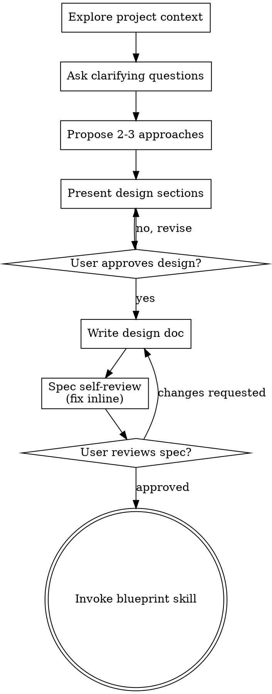

# Brainstorming Ideas Into Designs

Help turn ideas into fully formed designs and specs through natural collaborative dialogue.

Start by understanding the current project context, then ask clarifying questions to refine the idea. Once you understand what you're building, present the design and get user approval.

<HARD-GATE>
Do NOT invoke any implementation skill, write any code, scaffold any project, or take any implementation action until you have presented a design and the user has approved it. This applies to EVERY project regardless of perceived simplicity.
</HARD-GATE>

## Anti-Pattern: "This Is Too Simple To Need A Design"

Every project goes through this process. A todo list, a single-function utility, a config change — all of them. "Simple" projects are where unexamined assumptions cause the most wasted work. The design can be short (a few sentences for truly simple projects), but you MUST present it and get approval.

## Checklist

You MUST create a task for each of these items and complete them in order:

1. **Explore project context** — check files, docs, recent commits
2. **Ask clarifying questions** — as prose with trade-offs and a recommendation; label discrete options A/B/C so a one-line reply resolves each; bundle related questions when that is more efficient than a slow back-and-forth. Focus on purpose, constraints, success criteria.
3. **Propose 2-3 approaches** — with trade-offs and your recommendation
4. **Present design** — in sections scaled to their complexity, get user approval after each section
5. **Write design doc** — save to `docs/specs/YYYY-MM-DD-<topic>-design.md`
6. **Spec self-review** — quick inline check for placeholders, contradictions, ambiguity, scope (see below)
7. **User reviews written spec** — ask the user to review the spec file before proceeding
8. **Transition to implementation** — invoke the blueprint skill to create the implementation plan

## Process Flow

**The terminal state is invoking blueprint.** Do NOT invoke any implementation skill. The ONLY skill you invoke after brainstorming is blueprint.

## The Process

**Understanding the idea:**

- Check out the current project state first (files, docs, recent commits)
- Before asking detailed questions, assess scope: if the request describes multiple independent subsystems (e.g., "build a platform with chat, file storage, billing, and analytics"), flag this immediately. Don't spend questions refining details of a project that needs to be decomposed first.
- If the project is too large for a single spec, help the user decompose into sub-projects: what are the independent pieces, how do they relate, what order should they be built? Then brainstorm the first sub-project through the normal design flow. Each sub-project gets its own spec → plan → implementation cycle.
- For appropriately-scoped projects, ask clarifying questions to refine the idea.
- Ask design questions as prose: state the trade-offs and give your recommendation; label discrete options A/B/C so the user can resolve each with a one-line reply. Reserve multiple-choice UIs for quick operational picks — never for design/architecture decisions.
- Bundle related questions when that is more efficient than a slow one-at-a-time exchange. Don't overwhelm with a scattershot list, but don't artificially stretch a single decision across many messages.
- Focus on understanding: purpose, constraints, success criteria.

**Exploring approaches:**

- Propose 2-3 different approaches with trade-offs
- Present options conversationally with your recommendation and reasoning
- Lead with your recommended option and explain why

**Presenting the design:**

- Once you believe you understand what you're building, present the design
- Scale each section to its complexity: a few sentences if straightforward, up to 200-300 words if nuanced
- Ask after each section whether it looks right so far
- Cover: architecture, components, data flow, error handling, testing
- Be ready to go back and clarify if something doesn't make sense

**Design for isolation and clarity:**

- Break the system into smaller units that each have one clear purpose, communicate through well-defined interfaces, and can be understood and tested independently
- For each unit, you should be able to answer: what does it do, how do you use it, and what does it depend on?
- Can someone understand what a unit does without reading its internals? Can you change the internals without breaking consumers? If not, the boundaries need work.
- Smaller, well-bounded units are also easier for you to work with — you reason better about code you can hold in context at once, and your edits are more reliable when files are focused. When a file grows large, that's often a signal that it's doing too much.

**Working in existing codebases:**

- Explore the current structure before proposing changes. Follow existing patterns.
- Where existing code has problems that affect the work (e.g., a file that's grown too large, unclear boundaries, tangled responsibilities), include targeted improvements as part of the design — the way a good developer improves code they're working in.
- Don't propose unrelated refactoring. Stay focused on what serves the current goal.

## Visual Questions

For genuinely visual questions — mockups, layouts, diagrams, side-by-side design comparisons — don't try to settle them in prose. Produce a mock artifact (an HTML file or a screenshot written to the scratchpad) and have the user look at it, per the core UI rule: show a mock/screenshot before building, and a UI is not "done" until the user eyeballs it.

A question about a UI topic is not automatically visual. "What does personality mean in this context?" is conceptual — resolve it in text. "Which wizard layout works better?" is visual — show it.

## After the Design

**Documentation:**

- Write the validated design (spec) to `docs/specs/YYYY-MM-DD-<topic>-design.md`
  - (User preferences for spec location override this default)
- If the design doc should be committed, follow commit hygiene and the grant ledger (CLAUDE.md “Coding Baseline” and “Grant Ledger”): stage it explicitly (no bare `git add .`), and commit only under a recorded grant or fresh explicit approval. Never commit automatically.

**Spec Self-Review:**
After writing the spec document, look at it with fresh eyes:

1. **Placeholder scan:** Any "TBD", "TODO", incomplete sections, or vague requirements? Fix them.
2. **Internal consistency:** Do any sections contradict each other? Does the architecture match the feature descriptions?
3. **Scope check:** Is this focused enough for a single implementation plan, or does it need decomposition?
4. **Ambiguity check:** Could any requirement be interpreted two different ways? If so, pick one and make it explicit.

Fix any issues inline. No need to re-review — just fix and move on.

**User Review Gate:**
After the spec review loop passes, ask the user to review the written spec before proceeding:

> "Spec written to `<path>`. Please review it and let me know if you want to make any changes before we start writing out the implementation plan."

Wait for the user's response. If they request changes, make them and re-run the spec review loop. Only proceed once the user approves.

**Implementation:**

- Invoke the blueprint skill to create a detailed implementation plan
- Do NOT invoke any other skill. blueprint is the next step.

## Key Principles

- **Prose questions with a recommendation** — state the trade-offs and recommend; label discrete options A/B/C so a one-line reply resolves each
- **Bundle related questions** — efficient over scattershot; don't stretch one decision across many turns, don't dump an overwhelming list
- **YAGNI ruthlessly** — remove unnecessary features from all designs
- **Explore alternatives** — always propose 2-3 approaches before settling
- **Incremental validation** — present design, get approval before moving on
- **Be flexible** — go back and clarify when something doesn't make sense
